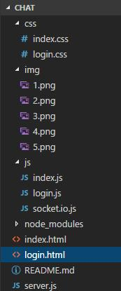
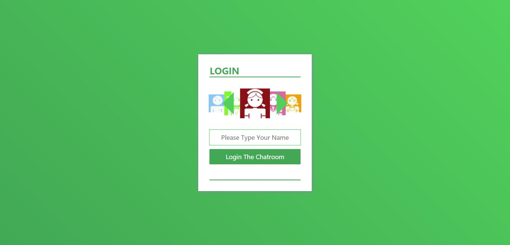
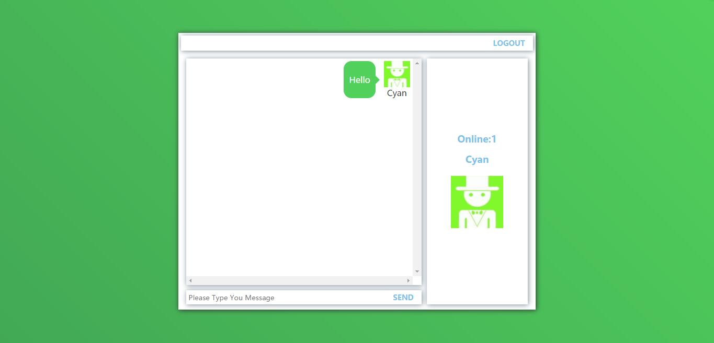

# chatroom
2017.06.25 
后端部分使用了Node.js + express 实现 
前端部分的布局使用了CSS3的flex来布局 
聊天页面的交互使用socket进行了聊天消息的发送与接收的消息机制，避免了用Ajax有时会丢失聊天消息的情况 
兼容性目前测试通过的有Chrome 58、Opera 45、Firefox 53、IE 11

待解决问题： 
用户名重复没有检测，后续打算添加用户注册功能，需要使用数据库 
无法查看聊天记录，后续打算使用数据库进行聊天记录存储 
代码规范还有待提高 
界面设计有待提高 

项目目录结构： 

效果图： 
Login 

index 

